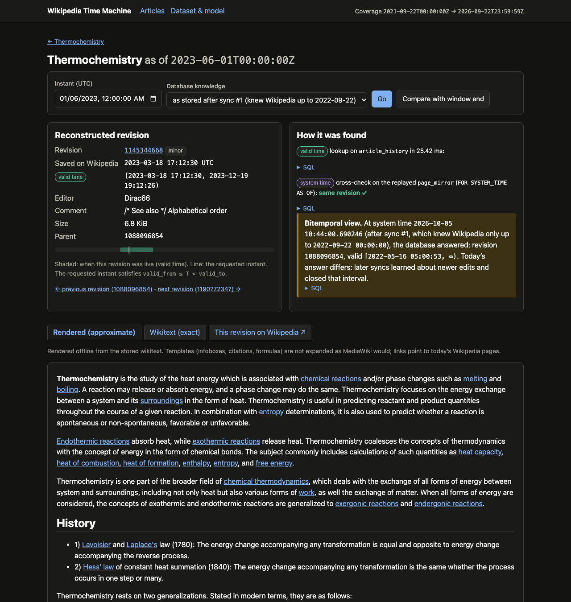
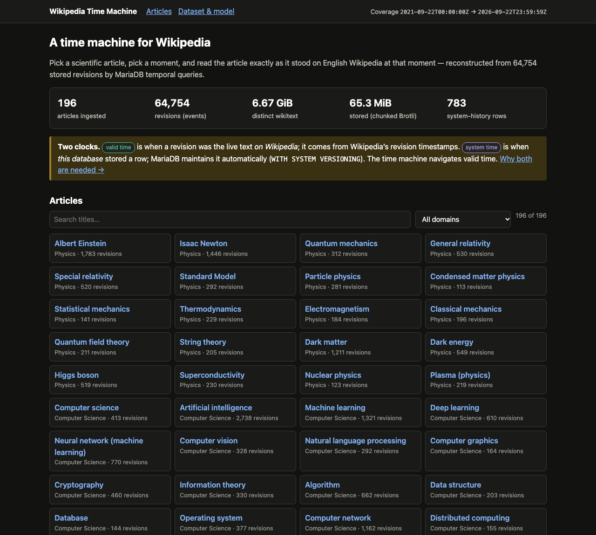
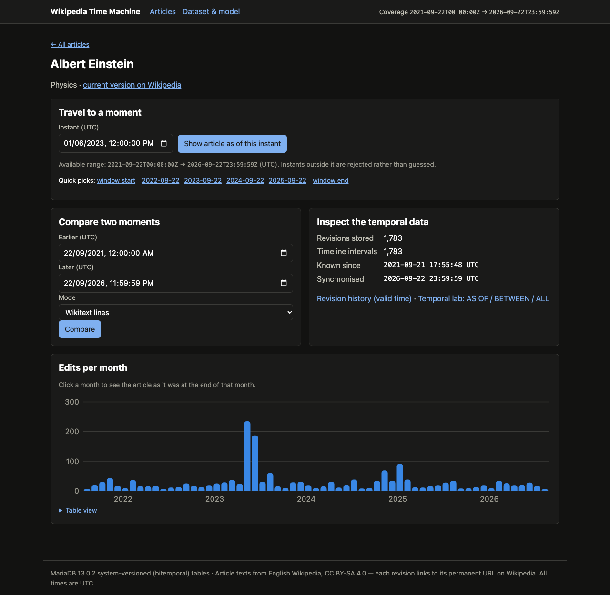
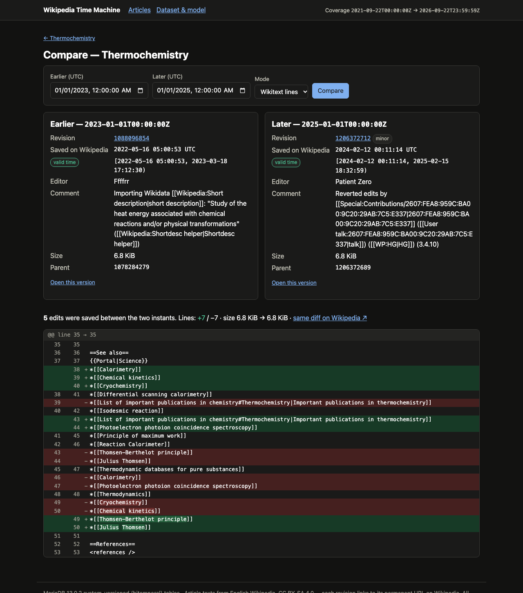
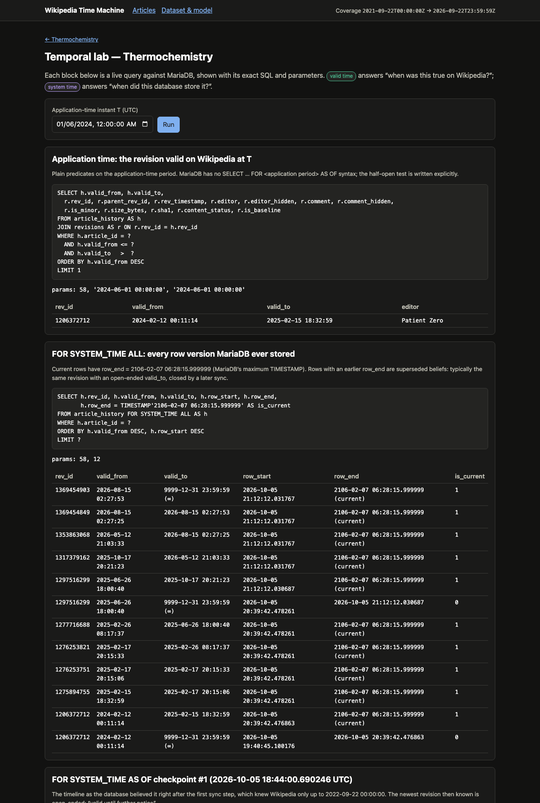

A project for area 3, "System-versioned tables: history for free" for the [MariaDB student database projects, 2026-09](https://mariadb.org/bachelor_hackathon_2026-09/).

# Wikipedia Time Machine: MariaDB system-versioned tables, explained by doing

[](https://github.com/zakariaderaoui-polimi/databases_project_cu_2026/actions/workflows/ci.yml)

**Team:** Zakaria Deraoui · Alice Ragni · Xiyuan Zhang · Anara Yusifzada (see [Team](#17-team)).
Developed and tested against **MariaDB 13.0.2** (`mariadb:13.0.2` Docker image).



Pick one of 200 curated scientific Wikipedia articles, pick a moment in the last five years, and read the article
**exactly as it stood on English Wikipedia at that moment**, compare two moments, and look at the SQL that
answered. Behind it is a bitemporal MariaDB 13.0.2 schema with real Wikipedia revision history:
**64,754 revisions of 196 articles** (2021-09-22 → 2026-09-22), 7.5 GiB of wikitext stored in 65 MiB,
a 64,753-row application-time timeline whose system history records 783 superseded beliefs, and a
`SYSTEM_TIME`-partitioned mirror in which MariaDB's own clock was replayed to Wikipedia time.

This README is a tutorial. It explains *what* MariaDB's temporal features do, *why* system time alone cannot
reconstruct Wikipedia's past, *how* application time and system time combine, and *what it costs*, with
numbers measured on the real dataset.

---

## Contents

1. [Quick start](#1-quick-start)
2. [Motivation and problem statement](#2-motivation-and-problem-statement)
3. [Architecture and technology](#3-architecture-and-technology)
4. [Dataset: selection, resolution, ingestion](#4-dataset-selection-resolution-ingestion)
5. [Two clocks: application time vs. system time](#5-two-clocks-application-time-vs-system-time)
6. [The data model](#6-the-data-model)
7. [MariaDB temporal SQL, with real examples](#7-mariadb-temporal-sql-with-real-examples)
8. [Historical reconstruction and interval semantics](#8-historical-reconstruction-and-interval-semantics)
9. [Partitioning by SYSTEM_TIME](#9-partitioning-by-system_time)
10. [Query plans and benchmarks](#10-query-plans-and-benchmarks)
11. [Content storage and rendering](#11-content-storage-and-rendering)
12. [What system versioning replaces, and what it does not](#12-what-system-versioning-replaces-and-what-it-does-not)
13. [Testing and validation](#13-testing-and-validation)
14. [Security](#14-security)
15. [Limitations, scaling, and when not to use a temporal database](#15-limitations-scaling-and-when-not-to-use-a-temporal-database)
16. [Repository layout](#16-repository-layout)
17. [Team](#17-team)

Deeper documents: [`docs/temporal-model.md`](docs/temporal-model.md) ·
[`docs/mariadb-13-findings.md`](docs/mariadb-13-findings.md) · [`docs/partitioning.md`](docs/partitioning.md) ·
[`docs/benchmarking.md`](docs/benchmarking.md) · [`docs/ingestion.md`](docs/ingestion.md) ·
[`docs/architecture.md`](docs/architecture.md) · generated [`benchmarks/reports/latest.md`](benchmarks/reports/latest.md).

---

## 1. Quick start

Requirements: Docker (Compose v2), Node.js ≥ 20.11, internet access to `en.wikipedia.org`, about 1.5 GB of free disk (images ≈ 0.8 GB, database volume ≈ 0.5 GB).

**One command** (after `git clone` and `npm install`):

```bash
npm run demo
```

It creates `.env` with random passwords, starts MariaDB 13.0.2 and waits until it is healthy, applies the
migrations, resolves the 200 curated titles, ingests five years of revisions for the **demo set** (one article
per domain, listed in `config/project.json → demo.articles`), replays the system-time mirror, validates
everything, and starts the web app on **http://localhost:3000**.

Measured from a clean copy of this repository (no `.env`, fresh database volume): **4 min 9 s** end to end, of
which 3.4 min were spent downloading 1,097 revisions (133 API requests, 32.8 MB of wikitext stored in 0.7 MB).
Validation passed, and application time and replayed system time agreed on all 800 probes. Re-running it took
29 s and changed nothing (0 revisions fetched, catalogue unchanged), because every step is idempotent.
`npm run demo -- --limit=25` ingests the first 25 curated articles instead.

Then try **`npm run explore`**: a self-checking walkthrough of the temporal features the app itself does not need
(transaction-precise history, `WITHOUT SYSTEM VERSIONING`, `system_versioning_asof`, `UPDATE … FOR PORTION OF`,
`ADD/DROP SYSTEM VERSIONING`, `TRUNCATE`). It prints every statement, the server's answer, and whether each
documented claim holds.

**Want the patterns without the app?** [`sql/`](sql/) holds them as plain SQL files to paste into your own schema:
bitemporal table and lookup, `FOR PORTION OF`, every `FOR SYSTEM_TIME` form, partitioning and retention, and the
time machine's own queries. Each runs with one command, e.g.

```bash
docker compose exec -T db sh -c 'mariadb --table -u"$MARIADB_USER" -p"$MARIADB_PASSWORD" "$MARIADB_DATABASE"' < sql/03_system_time_queries.sql
```

**Full dataset, step by step** (what `demo` does, without the limit):

```bash
npm run setup-env                        # .env from .env.example with random passwords (never overwrites)
docker compose up -d --wait db           # MariaDB 13.0.2; returns when healthy
npm install
npm run migrate                          # schema (forward-only migrations, non-destructive)
npm run ingest                           # resolve the 200 titles + download 5 years of revisions (≈ 3.5 h; resumable)
npm run replay-mirror                    # build the system-time simulation table (≈ 1 min)
npm run validate                         # integrity checks; non-zero exit on any error
docker compose up -d --build app         # web app on http://localhost:3000
```

* **Other subsets:** `npm run ingest -- --limit=10` or
  `npm run ingest -- --articles="Albert Einstein|Black hole"`. Everything else works the same.
* **Run the web app from the host instead:** `npm start` (port 3000) or `npm run dev`.
* **Without Node on the host:** every script also runs inside the app container, e.g.
  `docker compose exec app node scripts/ingest.js`.
* **Tests:** `npm test` (unit + integration + end-to-end against the real MariaDB container).
* **Benchmark:** `npm run benchmark` (see §10).
* **Development reset:** `npm run db:reset -- --yes` drops all tables (and their history) and re-applies migrations.
  Nothing destructive runs automatically: the app container only applies *pending* migrations at start-up.

| Command | Purpose |
|---|---|
| `npm run demo [-- --limit=N]` | everything above, end to end, for the demo set (or the first N articles) |
| `npm run explore [-- --only=trx-precise,…]` | self-checking experiments on the wider temporal feature set |
| `npm run setup-env` | create `.env` with random passwords |
| `npm run resolve-articles` | resolve curated titles → `data/articles.resolved.json` |
| `npm run ingest [-- --limit=N --articles="A\|B" --from=… --to=… --step-months=N --reuse-manifest]` | resolution + revision import |
| `npm run replay-mirror` | rebuild `page_mirror` (system time = Wikipedia time) |
| `npm run validate` | data and temporal invariants |
| `npm run benchmark` | real benchmarks → `benchmarks/` |
| `npm test`, `npm run test:unit`, `test:integration`, `test:e2e` | automated tests |

### HTTP routes

| Route | Returns |
|---|---|
| `GET /` | article selector (search + domain filter), dataset figures |
| `GET /articles/:id` | article overview, time picker, edits-per-month chart (click a month to travel there) |
| `GET /articles/:id/as-of?t=…[&checkpoint=N][&view=wikitext]` | reconstructed article, revision metadata, validity band, the SQL used, system-time cross-check, optional bitemporal view |
| `GET /articles/:id/diff?a=…&b=…[&mode=wikitext\|text]` | comparison of two instants |
| `GET /articles/:id/history?from=…&to=…&page=N` | revisions whose validity overlaps a range |
| `GET /articles/:id/temporal?t=…` | Temporal lab: live `AS OF` / `BETWEEN` / `ALL` / bitemporal queries with SQL |
| `GET /about` | temporal model summary, coverage, checkpoints, history growth, all 200 curated titles and their resolution |
| `GET /api/coverage`, `/api/articles[?domain=…]`, `/api/articles/:id` | JSON metadata |
| `GET /api/articles/:id/as-of?t=…[&checkpoint=N][&content=0][&render=1]` | JSON reconstruction (+ SQL and parameters) |
| `GET /api/articles/:id/diff?a=…&b=…`, `/api/articles/:id/history` | JSON diff (hunks) and history |
| `GET /health` | liveness + database connectivity |

Instants are UTC: `YYYY-MM-DD`, `YYYY-MM-DDTHH:MM[:SS]`, optionally with `Z` or `±HH:MM`. Malformed input
returns **400**, instants outside the dataset return **422** (`OUT_OF_COVERAGE`), unknown articles **404**,
too many requests **429**.

---

## 2. Motivation and problem statement

Wikipedia runs on MariaDB, yet it stores its history in application-level revision tables designed long
before databases could version rows themselves. Since SQL:2011, a table can keep its own history:

```sql
CREATE TABLE t (...) WITH SYSTEM VERSIONING;
SELECT * FROM t FOR SYSTEM_TIME AS OF TIMESTAMP '2024-01-01 00:00:00';
```

So the obvious question is: *can a system-versioned table replace Wikipedia's revision table, and give us a time
machine for free?*

Wikipedia's revision history is an ideal test case for temporal data:

* it is **real** and **public**, with precise, independently verifiable timestamps (every revision has a permanent URL);
* it has **both** kinds of time: the moment an edit happened on Wikipedia, and the moment our database learns
  about it, which can be years later;
* it is **messy** in instructive ways: same-second edits, reverts to identical texts, revision deletion,
  redirects and renamed pages;
* it is **large enough** that storage growth, partitioning and query plans matter: 64,754 revisions (24 to 2,738 per article, 330 on average) whose texts add up to 7.5 GiB.

The answer this project arrives at, with evidence, is: **system versioning alone cannot reconstruct
Wikipedia's past, because it records when the database changed, not when Wikipedia changed.** The past has to
be modelled explicitly as **application time**, and system versioning then records how the database's
*knowledge* of that past evolved. Combined, the table is **bitemporal**. Section 5 explains this; Section 7
shows the SQL.

---

## 3. Architecture and technology

```text
data/articles.json ─► resolver ─► data/articles.resolved.json ─► ingestion ─► MariaDB 13.0.2 ◄─ Express + EJS (read-only account)
   (curated, 200)     (MediaWiki API)       (generated)          (MediaWiki API)       ▲
                                                                     replay-mirror / validate / benchmark
```

| Concern | Choice | Why |
|---|---|---|
| Database | **MariaDB 13.0.2** (`mariadb:13.0.2` image) | system versioning, application-time periods, `WITHOUT OVERLAPS`, `FOR PORTION OF`, `PARTITION BY SYSTEM_TIME` |
| Backend | Node.js 22 + Express 5, `mariadb` connector | small, explicit; **raw parameterised SQL**, no ORM between the reader and the temporal features |
| Frontend | server-rendered EJS, plain CSS, about 50 lines of vanilla JS | the subject is the database; every page works without JavaScript |
| Wikitext rendering | `wtf_wikipedia` + `sanitize-html` | offline, deterministic rendering of stored wikitext; sanitised (§11, §14) |
| Diff | `diff` (jsdiff, Myers) | line diff + word highlighting with time/size budgets |
| Packaging | Docker Compose (db with health check + persistent volume + init script; app waits for the db) | one-command reproducibility |
| Tests | `node:test` | no test framework dependency; integration tests hit the real MariaDB |

Layering (details in [`docs/architecture.md`](docs/architecture.md)): routes → controllers (HTTP only) →
services (time-machine logic, diff, rendering) → repositories (**all SQL**, temporal SQL in
`src/repositories/temporalQueries.js`) → MariaDB. Ingestion, validation and benchmarks are separate modules
used by the CLI scripts.

---

## 4. Dataset: selection, resolution, ingestion

### 4.1 The curated list

`data/articles.json` holds **200 scientific articles**, 20 in each of 10 domains (Physics, Computer Science,
Chemistry, Biology, Mathematics, Astronomy, Earth Science, Engineering, Materials Science, Interdisciplinary
Science). It is the editorial source of truth: the code validates it (exactly 200 entries, no duplicate titles,
each with a domain) and never modifies it.

### 4.2 Resolution

Human-chosen titles are not page identifiers: they can be redirects, renamed pages, disambiguation pages,
or missing. `npm run resolve-articles` queries the MediaWiki API (4 requests of 50 titles) and classifies every
title deterministically: normalisation → redirect chain → page lookup → missing / invalid / namespace /
disambiguation checks → canonical URL taken from the API. A second pass detects titles that resolve to the
**same page** (the title that *is* the canonical title owns it). Full rules: [`docs/ingestion.md`](docs/ingestion.md).

Result of the run used for this README (`data/articles.resolved.json`, generated 2026-10-05):

```text
Requested:      200
Resolved:       191
Redirects:      5
Missing:        0
Disambiguation: 0
Duplicates:     4      (status `duplicate`: same page as another curated title)
Errors:         0
Usable (resolved + redirect): 196

[redirect]  "Optimization (mathematics)" -> Mathematical optimization
[redirect]  "Electronic engineering"     -> Electronics engineering
[redirect]  "Complex systems"            -> Complex system
[redirect]  "Bioengineering"             -> Biological engineering
[redirect]  "Biomedical science"         -> Biomedical sciences
[duplicate] "Materials engineering"      -> Materials science      (owned by "Materials science")
[duplicate] "Materials chemistry"        -> Materials science      (owned by "Materials science")
[duplicate] "Nanoscience"                -> Nanotechnology         (owned by "Nanotechnology")
[duplicate] "Scientific computing"       -> Computational science  (owned by "Computational science")
```

Nothing is silently dropped: the 4 duplicates are stored in `articles` with status `duplicate` and a pointer to
their owner, and are listed on the "Dataset & model" page. **196 distinct Wikipedia pages** are ingested.

### 4.3 Time window

Configured once in `config/project.json`:

```json
"window": { "start": "2021-09-22T00:00:00Z", "end": "2026-09-22T23:59:59Z" }
```

Instants outside the window are **rejected** (HTTP 422, with an explanation) rather than answered with
misleading data. For example, `2018-03-15` is outside the default window. Changing these two values and
re-running `npm run ingest` extends the dataset (later end: continues from each article's sync state; earlier
start: fetches the missing range and a new baseline). Nothing else in the code base contains these dates.

To know what an article looked like *at* the window start, the ingestion also fetches each article's
**baseline**: the last revision saved before the window. Its application time keeps its real (earlier)
timestamp. In the real data all 196 articles already existed at the window start, and their baselines were
saved between 2021-06-09 (*Mathematical optimization*) and 2021-09-21.

### 4.4 Ingestion

`npm run ingest` (details: [`docs/ingestion.md`](docs/ingestion.md)):

* fetches revision **metadata** first (500 per request, following `continue.rvcontinue` until exhausted), then
  downloads **wikitext only for SHA-1 digests not yet stored** (reverts reuse texts), verifying every text
  against Wikipedia's SHA-1;
* is **polite**: serial requests ≥ 300 ms apart, `maxlag=5`, descriptive User-Agent, bounded exponential backoff with
  jitter, `Retry-After`, no retries for permanent errors;
* is **idempotent and restartable**: Wikipedia `rev_id` and text SHA-1 are primary keys; each article step is one
  transaction; `article_sync_state` records progress; an advisory lock prevents concurrent runs;
* proceeds in **yearly sync steps** with a committed checkpoint after each, like a periodic sync job. This is
  what makes the system history meaningful (§5.3).

Result of the full run:

```text
Run #1  stopped by the 2-hour limit of the tool that launched it, during step 3 (marked "failed (abandoned)"
        by the next run); one article had failed on a transient Wikimedia `DBConnectionError` (now retried)
Run #2  resumed from article_sync_state: SUCCEEDED in 90.7 min, 0 failures, 1,752 API requests, 0 retries

Final state (both runs: 18:03 → 21:46 UTC, including a 12-minute pause between them)
  articles                196 (all synchronised to 2026-09-22 23:59:59; 0 created after the window start)
  revisions               64,754  (64,516 with text, 238 hidden by Wikipedia, 196 baselines)
  distinct texts          56,271  (6,834.6 MiB raw → 65.3 MiB in 1,656 Brotli chunks, 104.7×)
  timeline rows           64,753 current + 783 system-history rows (closed open-ended intervals)
  shadowed revisions      1  (Computer network, rev 1110203969, same second as its successor)
  checkpoints             7  (run #2 re-committed the two steps run #1 had already finished)
  API requests            ≥ 4,479 (run #1's counters are as last persisted before it was stopped)
  database size           158.7 MiB data + indexes (information_schema, after the benchmark)
```

---

## 5. Two clocks: application time vs. system time

This is the central idea of the project. Full treatment: [`docs/temporal-model.md`](docs/temporal-model.md).

### 5.1 The two questions

| | **Application time** (valid time) | **System time** (transaction time) |
|---|---|---|
| Question | *When was this revision the live text on Wikipedia?* | *When did this database store / believe this row?* |
| Source | Wikipedia's revision timestamp | MariaDB's clock at write time |
| Columns | `valid_from`, `valid_to` (`PERIOD FOR valid_period`) | `row_start`, `row_end` (`PERIOD FOR SYSTEM_TIME`) |
| Maintained by | the ingestion | MariaDB, automatically (`WITH SYSTEM VERSIONING`) |
| Queried with | predicates (`valid_from <= T AND T < valid_to`) | `FOR SYSTEM_TIME AS OF / BETWEEN / FROM … TO / ALL` |

### 5.2 Why the import time is the wrong clock

A Wikipedia revision saved on **2018-03-15 10:30 UTC** and imported on **2026-09-20 14:00 UTC** has

```text
application valid_from = 2018-03-15 10:30:00     "this text was the article from then on"
system      row_start  ≈ 2026-09-20 14:00:00     "the database contains this row from then on"
```

If history were reconstructed from system time (one row per article, updated during the import, queried with
`FOR SYSTEM_TIME AS OF`), every version would carry the import date: asking for the article "as of 2023" would
return **nothing**, because nothing was stored in 2023. System time is the history of the *database*. Wikipedia's
history must therefore be stored as **application time**, taken from Wikipedia's own timestamps.

A real example from this database:

```text
-- Albert Einstein, baseline revision (saved before the window, imported by run #1)
rev_id      1045649968
valid_from  2021-09-21 17:55:48     <- Wikipedia: saved by an editor that day
valid_to    2021-09-25 23:17:53     <- Wikipedia: the next revision
row_start   2026-10-05 18:04:40.371586   <- MariaDB: when this database stored the row
```

### 5.3 Why system time is still worth having: bitemporality

The ingestion learns about Wikipedia in yearly steps. After step 1 (knowledge up to 2022-09-22), an article's
newest known revision is valid "until further notice" (`valid_to = 9999-12-31 23:59:59`). Step 2 learns about the
next edit and closes that interval. MariaDB keeps the previous belief as a history row, automatically. So the
database can answer **both** "what was on Wikipedia at T?" and "what did *we* believe about T at time S?":

```sql
SELECT h.rev_id, h.valid_from, h.valid_to
FROM article_history FOR SYSTEM_TIME AS OF TIMESTAMP ? AS h   -- S: what the database knew then
WHERE h.article_id = ? AND h.valid_from <= ? AND h.valid_to > ?;  -- T: Wikipedia time
```

In the UI, the "Database knowledge" selector on every as-of page shows this. Example (real data,
*Thermochemistry*, T = 2023-06-01): with the knowledge of sync #1 the database answered revision
`1088096854`, valid `[2022-05-16 05:00:53, ∞)`; today it answers `1145344668`, valid from
`2023-03-18 17:12:30`. Both answers were correct *at their time*.

### 5.4 And the "history for free" design? Simulated, and used as a cross-check

`page_mirror` is the design the brief imagines: one row per article, updated for every edit, history kept by
MariaDB. `npm run replay-mirror` replays all revisions in chronological order while setting the **session
clock** to each revision's Wikipedia timestamp (`SET timestamp = …`), which simulates a database that had been
running live on Wikipedia. Then MariaDB's own system time *is* Wikipedia time and

```sql
SELECT rev_id FROM page_mirror FOR SYSTEM_TIME AS OF TIMESTAMP '2023-06-01 12:00:00' WHERE article_id = ?;
```

reconstructs the past with no extra columns. This is explicitly a simulation: it only works because
`secure_timestamp = NO` (MariaDB's default; a hardened server sets `YES` and nobody can forge system time).
The application's authoritative answer always comes from application time. The replay is shown next to it
as an independent cross-check, and `npm run validate` requires both to agree on hundreds of instants
(exactly on revision boundaries and one second before them). On the real data the replay applied 64,754
revisions in 66 s, `AUTO` created six yearly history partitions, and application time and replayed system time
agreed on **2,000 of 2,000** probes.

### 5.5 The design decision: how do Wikipedia's dates get into a versioned table?

System versioning stamps a row when the *statement* runs, so the real question of this area is where the
revision dates live. MariaDB offers four ways. This project implemented all four, and that is how it chose:

| Option | How | What `FOR SYSTEM_TIME AS OF '2023-06-01'` returns | Cost / risk | Used here |
|---|---|---|---|---|
| **A. Naive replay, import-time stamps** | `UPDATE` one row per article, in revision order, during the import | nothing: every version is stamped with the import day (2026-10-05) | none to build; the history describes the loading script, not Wikipedia | rejected; explained in §5.2 |
| **B. Replay under a forged session clock** | `SET timestamp = <revision time>` before each statement | the article on 2023-06-01 | needs `secure_timestamp = NO`; system time is no longer "when the database knew"; must replay in time order | `page_mirror` (§5.4), the cross-check and the partitioning study |
| **C. Write history directly** | `SET system_versioning_insert_history = 1`, then `INSERT … (…, row_start, row_end)` | the article on 2023-06-01 | same `secure_timestamp` condition (the documented precondition); current rows must use `row_end = 2106-02-07 06:28:15.999999` or they silently become history (§7, finding #2) | the benchmark's byte-identical history copies (`src/benchmark/suites.js`) |
| **D. Application-time period + real system versioning** | `PERIOD FOR valid_period (valid_from, valid_to)` from Wikipedia's timestamps, `WITH SYSTEM VERSIONING` on top | the same query is answered with `valid_from <= T < valid_to`; `FOR SYSTEM_TIME` keeps its honest meaning | two time dimensions to explain; MariaDB has no `SELECT … FOR <period> AS OF` syntax | **`article_history`, the authoritative model** |

**Why D.** Options B and C make system time *mean* Wikipedia time, and that only works by switching off the
guarantee that makes system time trustworthy (`secure_timestamp`), on a server where nobody else relies on it.
They also leave nowhere to record when *we* learned something. D keeps both truths: Wikipedia's timeline is data
(with `WITHOUT OVERLAPS` and the `valid_from < valid_to` check enforced by MariaDB), and system versioning records
how the database's knowledge of that timeline evolved, which is the bitemporal view of §5.3. B and C are still
in the project, because they answer the brief's literal question ("load revisions into a system-versioned
table and query it `AS OF`") and are what the partitioning measurements need. The validator proves that B and D
agree.

---

## 6. The data model

```text
domains ──< articles (SYSTEM VERSIONED: resolution audit)
                │
                ├──< revisions  (events: one row per Wikipedia revision, immutable)  >── revision_texts ──> content_chunks
                │        ▲                                                         (SHA-1 → byte range)   (Brotli streams)
                ├──< article_history  (BITEMPORAL: PERIOD valid_period + SYSTEM VERSIONING; FK → revisions)
                ├──< article_sync_state (SYSTEM VERSIONED: sync progress audit)
                └─── page_mirror (SYSTEM VERSIONED, PARTITION BY SYSTEM_TIME; rebuildable projection, no FKs)
ingestion_runs ──< sync_checkpoints (synced_through = application time, completed_at = system time)
```

Schema: [`db/migrations/`](db/migrations). Highlights:

| Table | Temporal role | Notable constraints |
|---|---|---|
| `articles` | system-versioned **audit** (renames/redirect changes kept for free) | `UNIQUE(owned_page_id)` on a *persistent generated column* so that only usable rows own a page; `CHECK`s for complete usable rows and duplicate pointers |
| `revisions` | **events** with Wikipedia's `rev_timestamp`; not versioned (immutable) | PK = Wikipedia `rev_id` (idempotency); `CHECK` content status ↔ SHA-1; FK to texts |
| `article_history` | **bitemporal state**: `PERIOD FOR valid_period` + `WITH SYSTEM VERSIONING` | `UNIQUE (article_id, valid_period WITHOUT OVERLAPS)`, implicit `valid_from < valid_to`, `UNIQUE(rev_id)`, FKs |
| `page_mirror` | system time = Wikipedia time (replay), partitioned yearly by `SYSTEM_TIME` | no FKs (not allowed on partitioned tables) |
| `content_chunks`, `revision_texts` | content-addressed, compressed text store | `CHECK(stored_bytes = LENGTH(payload))` |
| `sync_checkpoints` | links application-time knowledge horizon to system time | |

Why `revisions` and `article_history` are separate tables:

1. **Events vs. states.** A revision is a point-in-time fact that never changes; its *validity interval* is
   derived and does change when newer revisions become known. Only the changing part needs versioning.
2. **MariaDB forbids empty periods.** Revisions superseded within the same second would need `[T, T)`; a
   `PERIOD` implies `valid_from < valid_to` and `NOT NULL`. Such revisions remain events but are not on the
   timeline (the real data contains such a pair).

---

## 7. MariaDB temporal SQL, with real examples

All statements below run against the project schema. Self-contained, runnable versions of every pattern
(with expected results, checked in CI) are in [`sql/`](sql/README.md). Most are also visible live on each article's
**Temporal lab** page (`/articles/:id/temporal`) with their parameters and results.

### `WITH SYSTEM VERSIONING`

Adds two invisible-by-default bookkeeping columns (declared explicitly here as `row_start`/`row_end`,
`TIMESTAMP(6)`) and changes the meaning of DML: `UPDATE` and `DELETE` no longer destroy the old row but close it
(`row_end = now`) and keep it. Current rows have `row_end = 2106-02-07 06:28:15.999999`, the maximum TIMESTAMP
in MariaDB ≥ 11.5 (**not** 2038, as older documentation says). Plain queries see only current rows.
What MariaDB stores automatically: the full previous version of every changed row, with the exact interval during
which it was current.

### `FOR SYSTEM_TIME AS OF`

```sql
-- The application-time timeline of an article as the database believed it at system time S
SELECT rev_id, valid_from, valid_to, row_start, row_end
FROM article_history FOR SYSTEM_TIME AS OF TIMESTAMP ?            -- S
WHERE article_id = ?
ORDER BY valid_from DESC;
```

Half-open: a version is visible if `row_start <= S < row_end`.

### `FOR SYSTEM_TIME BETWEEN … AND …` (and `FROM … TO …`)

```sql
-- Every row version that was current at some moment between two sync checkpoints
SELECT rev_id, valid_from, valid_to, row_start, row_end
FROM article_history FOR SYSTEM_TIME BETWEEN TIMESTAMP ? AND TIMESTAMP ?
WHERE article_id = ?;

-- Every version of an article that was live on Wikipedia during 2023 (replayed mirror)
SELECT rev_id, row_start, row_end
FROM page_mirror FOR SYSTEM_TIME BETWEEN TIMESTAMP '2023-01-01 00:00:00' AND TIMESTAMP '2023-12-31 23:59:59'
WHERE article_id = ?;
```

`BETWEEN a AND b` includes versions that *start* exactly at `b`; `FROM a TO b` excludes them (tested).

### `FOR SYSTEM_TIME ALL`

```sql
-- Current rows and every superseded belief
SELECT rev_id, valid_from, valid_to, row_start, row_end,
       row_end = TIMESTAMP'2106-02-07 06:28:15.999999' AS is_current
FROM article_history FOR SYSTEM_TIME ALL
WHERE article_id = ?
ORDER BY valid_from DESC, row_start DESC;

-- History growth of the mirror, per year of row_end (= per history partition)
SELECT YEAR(row_end) AS year_closed, COUNT(*) AS row_versions
FROM page_mirror FOR SYSTEM_TIME ALL
WHERE row_end < TIMESTAMP'2106-02-07 06:28:15.999999'
GROUP BY YEAR(row_end);
```

### Application time: `PERIOD`, `WITHOUT OVERLAPS`, `FOR PORTION OF`

```sql
-- MariaDB rejects overlapping validity for the same article (ER_DUP_ENTRY) ...
UNIQUE KEY uq_article_history_no_overlap (article_id, valid_period WITHOUT OVERLAPS)

-- ... and closes an open interval declaratively when a newer revision arrives:
DELETE FROM article_history
  FOR PORTION OF valid_period FROM ? TO '9999-12-31 23:59:59'
WHERE article_id = ? AND rev_id = ?;
```

There is no `SELECT … FOR valid_period AS OF` in MariaDB (it is a syntax error); application time is queried
with ordinary predicates (§8).

More verified behaviour, including several surprises, is in
[`docs/mariadb-13-findings.md`](docs/mariadb-13-findings.md): for example, a *no-op* `UPDATE` on a versioned
table still writes a history row; explicit partition selection cannot be combined with `FOR SYSTEM_TIME`;
foreign keys protect only current rows.

### Beyond the time machine: `npm run explore`

The rest of the temporal surface in the MariaDB documentation is exercised by self-checking experiments
(`src/explore/experiments.js`, asserted in `tests/integration/explore.test.js`). Each one prints its SQL, the
server's answer, and whether the claim holds on the running server:

| Feature | What 13.0.2 actually does |
|---|---|
| transaction-precise history (`BIGINT UNSIGNED … AS ROW START`) | one version per *transaction* (two `UPDATE`s in one transaction → one version; TIMESTAMP versioning records both); `AS OF TRANSACTION id` works; `PARTITION BY SYSTEM_TIME` refused (error 4110); `AS OF TIMESTAMP` goes through `mysql.transaction_registry`, which records a forged session clock too |
| `WITHOUT SYSTEM VERSIONING` column | updates to it create no version, and its own history is lost |
| `system_versioning_asof` | implicit `AS OF` for every `SELECT`, not for DML. The documented reset `SET … = 'DEFAULT'` **fails with error 1231** and leaves current rows invisible; unquoted `DEFAULT` works |
| `UPDATE … FOR PORTION OF` | one row becomes three, and the original survives in system history |
| `ADD` / `DROP SYSTEM VERSIONING` | recording starts at `ADD`; `DROP` discards all history |
| `TRUNCATE` | refused (error 4137), history intact. The documentation's "drops all historical records" does not hold |
| same-timestamp DML | `UPDATE` leaves no zero-length version, `DELETE` does |

Two of these are documentation errors found by running the documented statements, and the build would catch it if a
future server version changed any of them.

---

## 8. Historical reconstruction and interval semantics

```sql
-- "Show me the article as it was on Wikipedia at T"  (src/repositories/temporalQueries.js, SQL_REVISION_AT)
SELECT h.valid_from, h.valid_to, r.rev_id, r.rev_timestamp, r.editor, r.comment, r.sha1, ...
FROM article_history AS h
JOIN revisions AS r ON r.rev_id = h.rev_id
WHERE h.article_id = ?
  AND h.valid_from <= ?      -- T
  AND h.valid_to   >  ?      -- T
ORDER BY h.valid_from DESC
LIMIT 1;
```

* No `FOR SYSTEM_TIME`: current knowledge (system time = now), filtered on application time.
* Intervals are half-open `[valid_from, valid_to)`; for revisions A (T1), B (T2), C (T3): A `[T1,T2)`,
  B `[T2,T3)`, C `[T3,∞)`. At exactly `T2`, B is returned.
* Same-second revisions: the highest `rev_id` wins (as on Wikipedia); the others are never visible.
* Before an article's first revision: "the article did not exist yet". Outside the window: rejected (422).
* The text is then loaded from the chunk store (SHA-1 verified) and rendered.

| Instant | Answer | Tested in |
|---|---|---|
| exactly a revision timestamp | that revision | `tests/unit/timeline.test.js`, `tests/integration/temporal.test.js` |
| one second before | the previous revision | idem |
| window start | the baseline revision (saved before the window) | integration |
| window end | the last revision (open-ended) | integration |
| before an article's creation | no revision + explanation | integration |
| `2018-03-15`, `2026-09-23` | HTTP 422 `OUT_OF_COVERAGE` | unit, integration, e2e |
| `2023-02-30`, `garbage`, fractional seconds | HTTP 400 | unit, e2e |

**Diff.** `/articles/:id/diff?a=…&b=…` reconstructs both instants with the same query, orders them
chronologically (and says so if swapped), shows both revisions' metadata, the number of edits saved in between,
and a line diff of the wikitext (or of the readable text, by sentence) with word-level highlighting. If both
instants fall in the same interval: "No difference — same revision". Hidden (revision-deleted) texts cannot be
compared and say so.

### What it looks like

All screenshots are of the real dataset (`docs/screenshots/`, captured from the running app with headless Chrome).

| | |
|---|---|
|  |  |
| **Home**: article selector with domain filter, dataset figures | **Article**: time picker, diff form, edits per month (click a bar to travel) |
|  |  |
| **Diff**: earlier/later revisions, edits in between, line + word diff | **Temporal lab**: live SQL; `is_current = 0` rows are superseded beliefs |

---

## 9. Partitioning by SYSTEM_TIME

Summary (full discussion: [`docs/partitioning.md`](docs/partitioning.md)):

* **What:** `page_mirror`, the one-row-per-article table updated for every edit, whose history grows with the
  edit rate. Partitioned `BY SYSTEM_TIME INTERVAL 1 YEAR … AUTO`: one `CURRENT` partition plus one history partition
  per year of `row_end`, created on demand.
* **Why not `article_history`:** its system history is small (one superseded belief per article and sync step)
  and partitioned InnoDB tables cannot have foreign keys (verified: errors 1506 and 150), whose integrity
  guarantees matter more there. Partitioning by application time was considered and rejected (§ in the doc).
* **Pruning (verified with `EXPLAIN PARTITIONS`):** non-temporal queries read only `pn`; `AS OF T` skips
  history partitions that ended before `T`, so the pruning is asymmetric (recent instants are cheap, old ones read more
  partitions). Prepared statements prune too.
* **Retention:** `ALTER TABLE … DROP PARTITION` removes whole years of history by dropping files instead of
  deleting rows.

Measured effects (derived stress dataset, see §10):

| Workload (1,036,048 row versions, 3,136 current) | unpartitioned | yearly (8 partitions) | monthly (64 partitions) |
|---|---:|---:|---:|
| current state, all articles (`SELECT COUNT(*), SUM(…)`) | 184.0 ms, 1,036,049 reads | **1.1 ms**, 3,137 reads (`pn` only) | 1.2 ms, 3,137 reads |
| `AS OF` T in 2025-26, all articles | 195.0 ms | **37.5 ms** (3 partitions) | 36.4 ms (11 partitions) |
| `AS OF` T in 2021-22, all articles | 245.4 ms | 239.8 ms (all 8 partitions) | 241.3 ms (63 partitions) |
| `BETWEEN` a one-month span | 251.0 ms | 131.6 ms (4 partitions) | 115.1 ms (17 partitions) |
| `ALL` | 146.9 ms | 150.4 ms | 179.2 ms |
| one article, current / `AS OF` | 0.45 / 0.57 ms | 0.47 / 0.56 ms | 0.45 / 0.80 ms |
| purge history before 2023 (294,608 rows) | `DELETE HISTORY` 1,811 ms | `DROP PARTITION p0, p1` **91 ms** | `DELETE HISTORY` 1,218 ms |
| allocated file size | 148 MiB | 176 MiB | **614 MiB** |

Median latencies; every layout returned identical answers. Read this as:

* **Current-state scans** are where `SYSTEM_TIME` partitioning shines (≈160× here): without it, InnoDB walks
  past a million history versions to find 3,136 current rows.
* **`AS OF` pruning is asymmetric:** recent instants touch 3 of 8 partitions (5× faster), old instants touch all of
  them (no gain). Partitions are bounded by `row_end`, so `row_start <= T` cannot prune.
* **Point lookups** by primary key are equally fast in every layout; partitioning does not help them.
* **Retention** by dropping partitions avoids row-by-row deletes (91 ms vs 1.8 s). The time is noisy: an
  identical earlier run measured 1,030 ms for the same `DROP PARTITION`. Treat it as "file-system work, not
  proportional to rows" rather than a precise factor.
* **Too fine is costly:** 64 monthly partitions quadrupled the file size (each partition allocates its own
  extents) and made `ALL` and point-in-time point lookups slightly slower, for marginally better pruning. Yearly is the
  better default here.

---

## 10. Query plans and benchmarks

`npm run benchmark` executes real queries and writes raw JSON plus a generated report
([`benchmarks/reports/latest.md`](benchmarks/reports/latest.md)). Methodology, metrics and threats to
validity: [`docs/benchmarking.md`](docs/benchmarking.md). In short: server-side prepared statements on one
connection, fixed-seed workloads, a warm-up pass, `reps` timed passes, median/p95/p99 latency, storage-engine
reads per query from `Handler_read_*` deltas, `EXPLAIN PARTITIONS` + `ANALYZE FORMAT=JSON` plans, and answer
cross-checks between strategies. All measurements are warm-cache; cold-cache behaviour is not measured.

Results of the run in `benchmarks/reports/latest.md` (MariaDB 13.0.2 aarch64 in Docker Desktop, 512 MiB buffer
pool; client Node 23 on an Apple M1, 8 GiB):

**Which revision was live at T?** 2,000 random (article, instant) pairs × 3 passes on the real dataset:

| Strategy | median ms | p95 ms | storage-engine reads / query | plan (`ANALYZE`) |
|---|---:|---:|---:|---|
| application time, interval predicate + `ORDER BY valid_from DESC LIMIT 1` (**production**) | 0.517 | 1.340 | **1.2** | range on PRIMARY, r_rows 1 |
| same predicate without `ORDER BY … LIMIT 1` | 0.511 | 0.887 | 132.1 | range on PRIMARY, r_rows 72 |
| same predicate through the `WITHOUT OVERLAPS` index | 0.481 | 0.635 | 2.0 | range, r_rows 1 |
| events only: latest `rev_timestamp <= T` (MediaWiki-style) | 0.463 | 0.699 | 1.0 | range, r_rows 1 |
| system time: `page_mirror FOR SYSTEM_TIME AS OF T` (partitioned) | 0.529 | 0.874 | 153.2 | 4 partitions, r_rows 52 |
| system time: identical history, unpartitioned | 0.528 | 1.319 | 149.9 | r_rows 52 |
| bitemporal: production query on `article_history FOR SYSTEM_TIME AS OF <checkpoint #1>` | 0.503 | 0.704 | 108.9 | r_rows 49 |

All strategies returned the same revision for all 2,000 pairs (the bitemporal one differs for 1,569 pairs, as
it should: it answers with the knowledge of 2022-09-22).

What the numbers say:

* At this size every strategy answers in about half a millisecond, which is dominated by the client↔server round trip.
  The machine-independent signal is the **work per query**: the production query reads ~1 index entry, while the bare
  interval predicate reads ~130 (all intervals that started before T), and the system-time lookups read ~150
  (all row versions of the article whose `row_end > T`). The bare predicate's cost grows with history length.
* `ORDER BY valid_from DESC LIMIT 1` is what turns the interval test into a one-entry probe. The optimizer does not
  infer it from `WITHOUT OVERLAPS`.
* The `WITHOUT OVERLAPS` index (`article_id, row_end, valid_to, valid_from`) also answers in ~2 reads: its leading
  `valid_to > T` range starts exactly at the interval containing T.
* **System time is not an index-friendly way to ask "as of T"** for a single article: `AS OF` must filter
  `row_start <= T < row_end` over all versions sharing the primary key, and partitioning only removes versions that ended
  before T. Explicit application-time intervals with a suitable index are cheaper.
* The event-only formulation is as cheap as the interval one for lookups. Intervals earn their keep through
  constraints (`WITHOUT OVERLAPS`), range queries ("what was live during 2023?") and bitemporal history.

---

## 11. Content storage and rendering

**Storage.** The exact wikitext of every revision is stored, so any version can be reconstructed and verified
(SHA-1) without contacting Wikipedia. Consecutive revisions of an article are almost identical, which per-row
compression (InnoDB page compression or MariaDB's `COMPRESSED` columns: ~3× on our data) cannot exploit.
Texts are therefore deduplicated by SHA-1 and appended chronologically into **chunks** (≤ 8 MiB) compressed with
Brotli using a 16 MiB window, so each revision compresses mostly into references to the previous one.

Measured (benchmark §3):

| Storage of the same texts | size | relative to raw |
|---|---:|---:|
| one full copy per revision (what the history would weigh with the text inline) | 7,709 MiB | 1× |
| distinct texts only (SHA-1 deduplication) | 6,835 MiB | 1.1× smaller |
| **this project's chunk store** (`content_chunks`) | **65.3 MiB** | **118× smaller** |
| inline-text experiment, 5 articles / 1,450 revisions / 151 MiB raw: system-versioned `MEDIUMTEXT` | 176 MiB file | 0.9× |
| same, `MEDIUMTEXT COMPRESSED` (MariaDB column compression) | 76 MiB file | 2.0× |
| same 5 articles in the chunk store | 1.3 MiB | 117× |

This is the practical answer to "history for free": the *mechanism* is free, the *bytes* are not. Each version of
a system-versioned row is a full copy. For large, slowly-edited documents, keep the payload out of the versioned row
(here: a SHA-1 reference) and store it deduplicated and delta-compressed.

**Rendering.** Wikitext is rendered at read time by `wtf_wikipedia`, an offline parser. This is deterministic,
needs no network access and works for any historical revision. The trade-off is fidelity: templates, Lua modules,
references and math are not expanded as MediaWiki would. The rendered view is labelled "approximate", the exact
wikitext is one tab away, and every revision links to its permanent URL on Wikipedia. Links inside articles point
to *today's* Wikipedia pages. Storing MediaWiki-rendered HTML instead would mean one `action=parse` call per revision
(tens of thousands of expensive requests), HTML that depends on templates as they are *today*, and much larger
untrusted markup to sanitise.

---

## 12. What system versioning replaces, and what it does not

**It replaces** (and this project uses it that way):

* hand-written **audit tables** and the **triggers** that fill them: `articles` (title resolution) and
  `article_sync_state` (sync progress) are versioned; every change is kept, nothing in the code maintains it;
* **ad-hoc timestamped snapshots** of database state, and application code that copies rows before changing them;
* "what did the database contain at time S" queries: `FOR SYSTEM_TIME AS OF S`;
* "how did our knowledge change" bookkeeping: the superseded open-ended intervals in `article_history`.

**It does not replace:**

* **the source system's historical semantics**: Wikipedia's revision history is application time and must be
  imported and modelled as such (§5.2);
* **Wikipedia's revision table itself**: revisions carry author, comment, parent, minor flag; they are events with
  meaning, not "old versions of a row";
* **business-validity modelling**: "this text was live from … to …" is application time (`PERIOD`, `WITHOUT OVERLAPS`);
* **event sourcing in general**: system versioning stores states, not the intent of a change;
* **domain-specific event logs** (reverts, page moves, protections);
* **full content version control**: no branches, merges, blame or delta storage; every version is a full row copy
  (measured cost in §10);
* **privacy workflows**: history is kept until explicitly purged (`DELETE HISTORY`, dropping partitions); data
  hidden by Wikipedia for privacy reasons would survive in system history unless purged.

---

## 13. Testing and validation

`npm test` runs three suites with Node's built-in runner. Integration and end-to-end tests run against the real
MariaDB 13.0.2 container (separate database `wiki_time_machine_test`, reset from the migrations); only the
*external* MediaWiki API is replaced by a deterministic fake (`tests/fixtures/fakeWikipedia.js`). MariaDB's
temporal semantics are never mocked.

Latest run (`npm test`, MariaDB 13.0.2): **110 tests, 110 passed**: 45 unit, 57 integration, 8 end-to-end.

**Continuous integration** ([`.github/workflows/ci.yml`](.github/workflows/ci.yml)) runs the same three suites on
every push and pull request, starting MariaDB 13.0.2 exactly as a reader would (`docker compose up --wait db`
with `db/init`, credentials generated by `npm run setup-env`), and builds the application image.

| Suite | What it covers |
|---|---|
| unit (`tests/unit`) | timestamp grammar and calendar validation, coverage boundaries, sync cutoffs, interval construction (half-open, same-second shadowing, middle insertion, invariant violations), title resolution (normalisation, redirects, cycles, missing, disambiguation, namespaces, duplicate ownership), diff hunks and word highlighting, configuration parsing, chunk compression and corruption detection, HTML sanitisation, API client retries/backoff/serialisation |
| integration (`tests/integration`) | MariaDB version; system-versioned tables; `WITHOUT OVERLAPS`; implicit period check; `FOR PORTION OF` + history; `AS OF`/`BETWEEN`/`FROM…TO`/`ALL` boundaries; partition pruning; no-op-UPDATE history; FK/history interaction; ALTER restrictions; ingestion: yearly steps, same-second shadowing, baseline, articles created inside the window, deduplication, hidden content, **re-run idempotency, forced re-fetch, outage mid-run + restart, SHA-1 corruption, advisory lock, pagination, window extension**; replay agreement; service-level reconstruction of all edge cases in the specification; diff edge cases; bitemporal checkpoint view; every file in `sql/` executed as written with its documented results; every `npm run explore` claim (transaction-precise history, column exclusion, `system_versioning_asof`, `UPDATE … FOR PORTION OF`, `ADD/DROP SYSTEM VERSIONING`, `TRUNCATE`, same-timestamp DML) |
| e2e (`tests/e2e`) | app starts, health, article list + domain filter, historical article (HTML + JSON), diff, invalid/out-of-coverage dates, security headers and XSS fixture, history/temporal/about pages, read-only web account |

`npm run validate` checks the live data: curated list (200, unique), manifest consistency, resolution counts,
duplicate page ids, duplicate revision ids, revisions inside the window, FK consistency, text availability,
`valid_from < valid_to`, no overlaps, no gaps, `valid_from` = Wikipedia timestamp, `valid_to` = next timestamp,
exactly one open-ended interval per article, every revision on the timeline or shadowed, system-history
consistency, checkpoint ordering, sync completeness, sampled content integrity (decompress + SHA-1), and agreement
between application-time and replayed system-time answers. Any error-level failure exits non-zero.

Result on the full dataset (`npm run validate -- --sample-texts=1000 --sample-instants=1000`): **31 checks passed,
0 warnings, 0 errors**, including 1,000 sampled texts verified and 2,000 application-time/system-time probes in agreement.

---

## 14. Security

* **Parameterised SQL everywhere.** Values are always bound with `?`. Identifiers cannot be parameters in SQL,
  so the few places that name a table or column dynamically (benchmark tables, catalogue columns, partitions)
  pass it through `ident()` in [`src/db/sql.js`](src/db/sql.js), which enforces a whitelist and a strict pattern and back-quotes it.
  Numbers that must appear in SQL text go through `boundedInt()` (unit-tested against injection strings). The web server connects with a
  **SELECT-only** account (`wtm_web`): it can neither modify data nor purge history (e2e-tested).
* **Strict input validation** (ids, instants with real-calendar checks, ranges, modes, checkpoints) with 400/422
  responses and clear messages.
* **XSS**: wikitext is untrusted input. Rendered HTML is sanitised with an allow-list (no scripts, handlers,
  styles, images, iframes; only http(s) links, rewritten to `en.wikipedia.org` with `rel="nofollow noopener noreferrer"`); everything
  else is EJS-escaped; a strict CSP (`script-src 'self'; style-src 'self'; object-src 'none'; frame-ancestors 'none'`)
  is a second layer. The pages contain no inline scripts or inline styles. A test revision with `<script>`/`onerror` proves it.
* **Expensive endpoints are rate-limited** (per IP); diffs have time, edit-length and size budgets.
* **Safe errors**: internal details are logged, never returned. **No secrets** in Git (`.env` is ignored;
  `.env.example` documents the variables). Ports are bound to `127.0.0.1`.
* **Operational note:** `secure_timestamp = NO` is required only by the page_mirror simulation. A production
  server keeping audit history should run with `secure_timestamp = YES` so that system time cannot be forged.

---

## 15. Limitations, scaling, and when not to use a temporal database

**Limitations**

* The dataset covers 2021-09-22 → 2026-09-22 (plus each article's baseline); other instants are refused.
* Rendering is approximate (no template expansion); the exact wikitext is always available.
* Revisions hidden by Wikipedia *after* the import are not re-checked; texts hidden *before* it are stored as hidden.
* The page_mirror replay relies on `secure_timestamp = NO`; it is a simulation, not the real system history.
* A full import takes hours, because it is bounded by Wikipedia's serial response time (resumable; subsets are available).
* Benchmarks: one machine, warm cache only, Docker Desktop VM; the partition suite uses derived data.
* Wikipedia changes: re-resolving later may yield different canonical titles (kept auditable by `articles`' history).

**How the system could scale**

* **More articles / longer windows:** ingestion is per article and resumable; storage grows with distinct texts
  (compressed ~100×), timeline rows grow with revisions (tens of bytes each). The main lookup is a single
  index probe independent of history length.
* **History growth:** partition by `SYSTEM_TIME` and drop old history partitions (retention); keep large payloads
  (texts) out of versioned rows.
* **Throughput:** the web tier is stateless (a chunk LRU cache per process) and read-only, so it can scale horizontally behind
  MariaDB replicas; hot chunks could move to a shared cache.
* **Ingestion speed:** Wikipedia's [EventStreams](https://wikitech.wikimedia.org/wiki/Event_Platform/EventStreams)
  could keep the mirror current in near real time instead of batch sync; dumps (`dumps.wikimedia.org`) are better
  than the API for very large article sets.

**When a temporal database is not the right solution**

* when the history *is* the domain (version control, ledgers, Wikipedia's own revision table): model events explicitly;
* when rows are huge and change by small edits: full-row versioning multiplies storage (measured in §10);
* when rows change constantly and history is almost never read;
* when data must be forgettable by law and nobody owns history retention;
* when history must be portable across heterogeneous systems (system-versioned history is engine state).

---

## 16. Repository layout

```text
├── README.md                    this tutorial
├── docker-compose.yml           MariaDB 13.0.2 (health check, volume, init) + app
├── Dockerfile, .env.example, .gitignore, package.json, package-lock.json
├── config/project.json          dataset window, API etiquette, limits (single source of truth)
├── data/articles.json           curated list (authoritative, unmodified)
├── data/articles.resolved.json  generated resolution manifest
├── db/migrations/               001 core schema · 002 bitemporal article_history · 003 page_mirror
├── db/init/                     container init: test database, read-only web account
├── db/conf/time-machine.cnf     server settings (UTC, secure_timestamp, buffer pool)
├── sql/                         reusable temporal SQL: 5 runnable files, values asserted in CI
├── src/                         app.js, server.js, config/, db/, wikipedia/, temporal/, content/, ingestion/,
│                                repositories/, services/, controllers/, routes/, middleware/, views/, public/,
│                                validation/, benchmark/
├── scripts/                     migrate, db-reset, wait-for-db, resolve-articles, ingest, replay-mirror, validate, benchmark
├── tests/                       unit/, integration/, e2e/, fixtures/, helpers/
├── benchmarks/                  results/ (raw JSON), reports/ (generated Markdown)
└── docs/                        temporal-model, mariadb-13-findings, partitioning, benchmarking, ingestion, architecture, requirement
```

---

## 17. Team

| Name |
|---|
| Zakaria Deraoui |
| Alice Ragni |
| Xiyuan Zhang |
| Anara Yusifzada |

Built for the MariaDB student database projects at Constructor University (2026-09), area 3.

License: code MIT. Article texts © Wikipedia contributors, CC BY-SA 4.0. Every revision links to its source.
